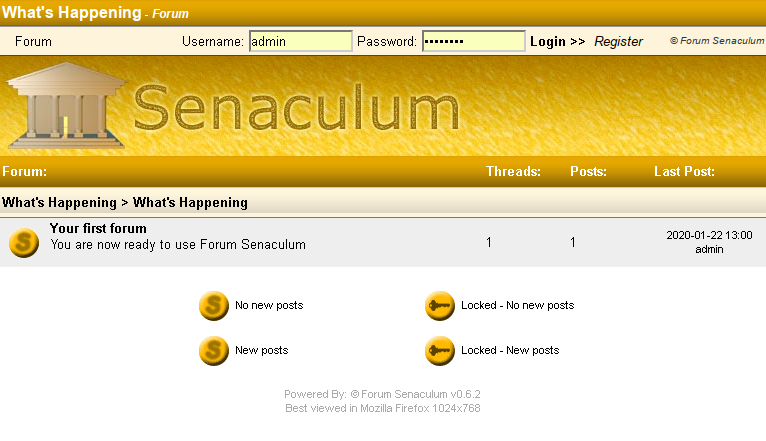

# Forum Senaculum but it's Dockerized

Here it is. Slize106's Forum Senaculum but it's put in a frankensteinish Docker
container thing. The thing that powered the [FamiTracker forums](http://famitracker.com/forum) for years. They probably moved on because Senaculum is
basically dead (possible security risks, too) and they have since moved on to a more maintainable
[phpBB install](http://forums.famitracker.com/).

The latest version the [Wayback Machine](https://web.archive.org/web/20080217065745/http://senaculum.shoodot.net/downloads.php) has is version 0.6.2,
and there's still a whole lot to fix even with a questionable environment: newest MariaDB but with PHP5. Right now you couldn't do much of anything since the SQL queries are all messed up.

